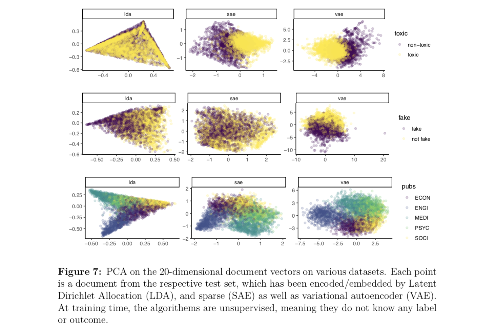

```{r setup, include=FALSE}
knitr::opts_chunk$set(echo = TRUE)
```


This is a code repo for my working paper: *An Autoencoder Approach to Topicmodeling* (in R). You can download the paper [here](https://github.com/systats/neural_topicmodels/raw/master/paper/css_paper.pdf).

<center>

</center>
